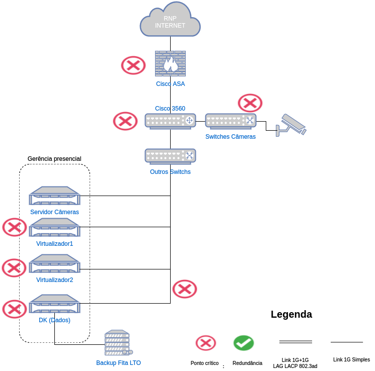
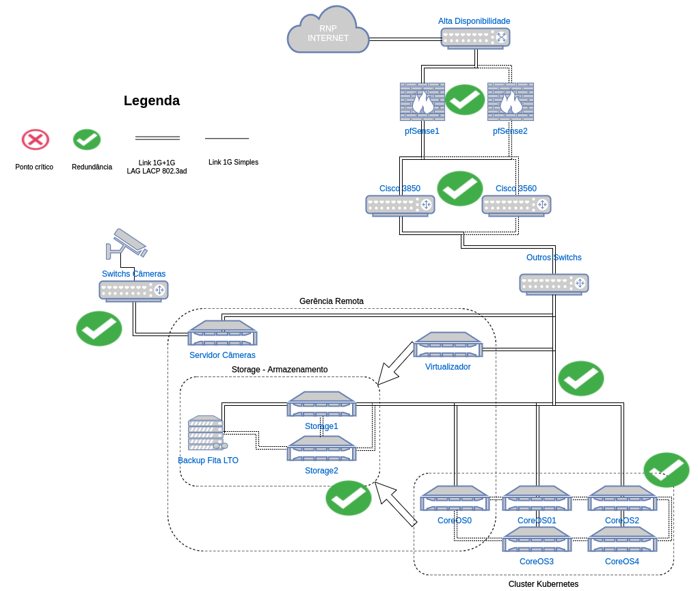
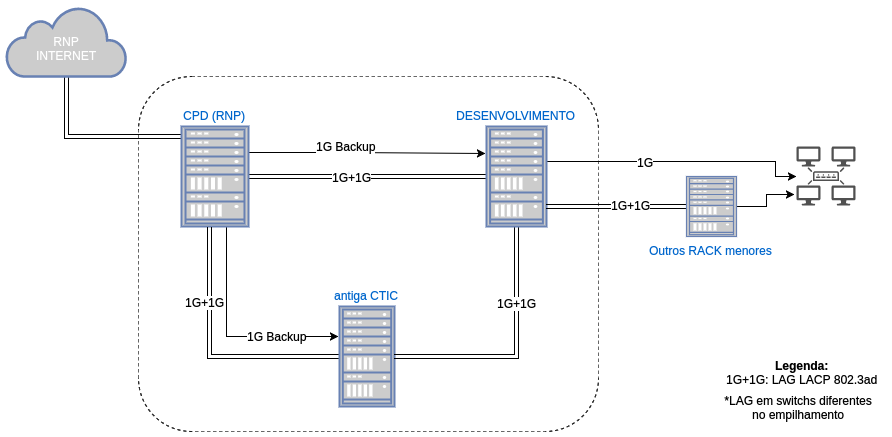
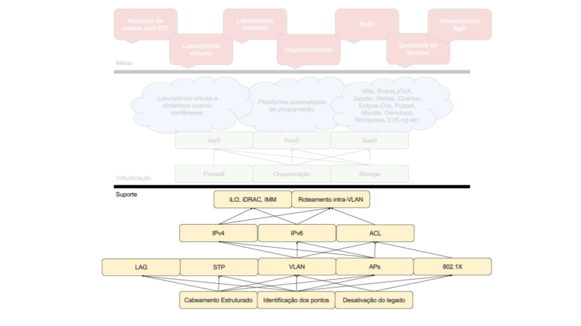
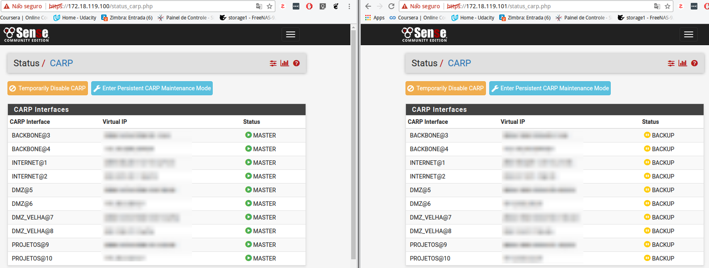
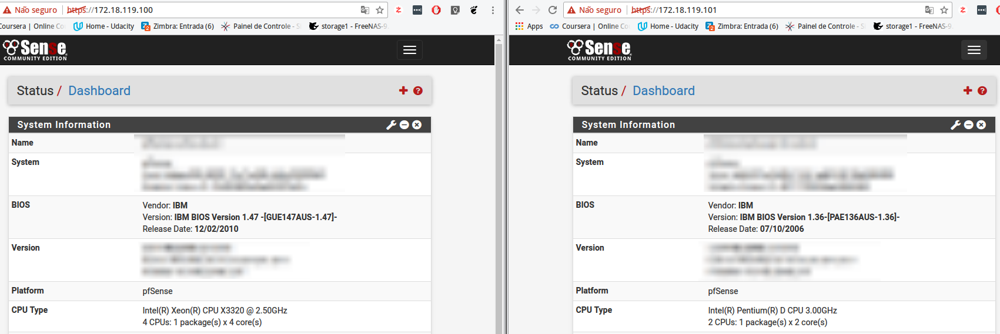

# Infraestrutura de TI do IFSC câmpus São José

A CTIC atualmente administra em sua infraestrutura:
* 14 Servidores físicos
* 37 Switches gerenciáveis (+ alguns não gerenciáveis)
* Firewall PFSense com redundância ativa de _hardware_ via [CARP](https://www.freebsd.org/doc/handbook/carp.html)
* 25 APs Cisco séries 1600 e 2600
* 380 Computadores
* Central telefônica com aproximadamente 70 ramais
* +30 Servidores Virtuais ([página Web](http://sj.ifsc.edu.br), [wiki](http://wiki.sj.ifsc.edu.br), câmeras e outros)

Em 2016 foram iniciados vários projetos para implementar técnicas de redundância nas várias camadas na infraestrutora do câmpus. Com o objetivo de obter alto nível de maturidade, segurança e estabilidade da infraestrutura, assim foi adotado o suporte a outros projetos relacionados, como por exemplo [contêineres](https://github.com/ctic-sje-ifsc/coreos) e [orquestrador](https://github.com/ctic-sje-ifsc/kubernetes) nos serviços.

Foram constatados vários problemas como:

* Sem redundância de 
  * _Firewall_ (1 Cisco ASA 5510)
  * Servidor de arquivos
  * _Core switch_
  * Virtualizadores
* Vários _switches_ não gerenciáveis
* Sem documentação da infraestrutura
* Muito cabeamento  antigo nas calhas e _racks_
* Cobertura Wi-Fi com problemas
* Sem gerenciamento remoto dos servidores
* Identificação do cabeamento estruturado desatualizada

### Infraestrutura anterior e atual (problemas)

### Infraestrutura atual e futuro (soluções)

### Segurança e estabilidade da nossa rede hoje

Essas ações fazem parte de um projeto macro, e implementa o suporte confiável as outras camadas.

### Metas alcançadas
* Cabeamento novo, eliminando os _switches_ críticos não gerenciáveis
* Infraestrutura, conexões, VLAN, IPv4 e IPv6 documentados no [Netbox](https://netbox.sj.ifsc.edu.br/)
* Limpeza e organização dos _racks_ e nas calhas (literalmente Km de cabos)
* Reposicionamento de APs
* Habilitado o gerenciamento remoto (ILO, iDRAC e IMM) nos servidores
* Atualização da ferramenta de monitoramento (Zabbix)
* Migração para nova faixa IPv4 e implantação do IPv6
* Implantação de VLANs baseado no GT-VLAN

### Metas a serem alcançadas
* Reorganização dos Racks centrais (75% concluído)
* Padronização e aplicação da identificação do cabeamento estruturado, conforme a [monografia da aluna Luana Beatriz da Silva](http://wiki.sj.ifsc.edu.br/wiki/index.php/Projeto_de_Reestrutura%C3%A7%C3%A3o_do_Cabeamento_Estruturado)
* Melhorar o monitoramento Zabbix
* Autenticação por porta em pontos públicos (802.1X)
* Política de acessos nas VLAN (ACL)

# Alta disponibilidade no _firewall_
Recentemente foi implementada a [redundância ativa](https://doc.pfsense.org/index.php/High_Availability) de _firewall_ via servidores físicos distintos, onde foi feito o [registro em vídeo](https://youtu.be/jkS7ZbTbtkA):

-

### CARP Status - _Firewall_ pfSense mestre e escravo: CARP Status

### _Hardware_ diferente dos dois nós do pfSense:

